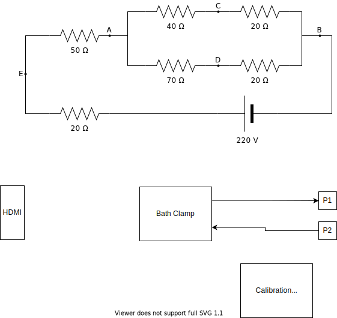

# covg_clamp
KiCad schematic and layout for COVG bath and guard clamps

## Library Setup 
Before opening the project complete these steps to setup your parts libraries. 

* On the main Kicad Menu bar click 'Preferences' -> 'Configure Paths'. 
* Then within the 'Configure Paths' window create an Environmental Variable with the 'Name' MYLIBRARY.
* Set the 'Path' to be where you will store the Digikey libraries and the COVG custom library. For example (this is on a MAC) '/Users/lucas/Documents/kicad/libraries'.

Now *git clone* (effectively download) the digikey and COVG libraries. 

* The Digikey library is at [https://github.com/Digi-Key/digikey-kicad-library](https://github.com/Digi-Key/digikey-kicad-library)
	* Use the terminal command: `git clone https://github.com/Digi-Key/digikey-kicad-library.git ` 

* The custom COVG library is at [https://github.com/lucask07/covg-kicad-lib](https://github.com/lucask07/covg-kicad-lib)
	* Use the terminal command: `git clone https://github.com/lucask07/covg-kicad-lib.git ` 

## Current Draw

+/-15 V  (or from supply derived from +/-15 V  

| Component | Quantity | Current [mA]| Total [mA] |
| --------- | -------- | ------------| ---------- |
| OPA828    | 2        | 5.5 | 11 |
| OPA2156   | 2 (dual) | 4.4 | 8.8 |
| OPA991S   | 1        | 0.56 | 0.56 |
| ADG1208   | 1        | 0.0001 | 0 |
| ADG1208   | 1        | 0.0001 | 0 |
| AD8421    | 1        | 2.3    | 2.3 |
| ADA4932   | 1        | 9.6    |     |
| or LMP8350 |         | 15 (HP mode) | 15 |
|           |          |        | Totals (w/ LMP) |
|           |          |        |    37.66 |

## HDMI 
An HDMI-A cable is used for input output signals. The HDMI carries:

- **power**: +5V, +15V, -15V
- **Analog outputs** (to ADCs): differential pair OUT\_P, OUT\_N; single-ended out AMP\_OUT, CAL\_ADC
- **Digital inputs** (from DACs): CMD, CC, CAL_DAC
- **Digital control** (I2C): SDA, SCL (3.3 V levels)
- **Analog reference**: buffered VCM differential ADC common-mode voltage 

| Pin | HDMI name    | Generic      | Bath clamp | Notes                                                                     |
|-----|--------------|--------------|------------|---------------------------------------------------------------------------|
| 1   | Data2+       | fastDAC1     | CMD        | ~1 us settling time                                                                          |
| 2   | Data2 shield | gnd          | gnd        |                     w                                                      |
| 3   | Data2-       | Analog/GPIO1 | CAL_DAC    |  DAC8050, 16 bit, 5us settle, 5 V supply                                                                         |
| 4   | Data1+       | fastADC+     | IM_P       | to AD7960/AD7961. Differential low-pass filter on DAQ board                                                                          |
| 5   | Data1 shield | gnd          | gnd        |                                                                           |
| 6   | Data1-       | fastADC-     | IM_N       | to AD7960/AD7961. Differential low-pass filter on DAQ board                                                                          |
| 7   | Data0+       | fastDAC2     | CC         | ~1 us settling time                                                                          |
| 8   | Data0 shield | gnd          | gnd        |                                                                           |
| 9   | Data0-       | Analog/GPIO2 | CAL_ADC    | to ADS8686 1 MSPS, programmable PGA                                                            |
| 10  | Clock+       | 15V          | 15V        | linear regulator, 75 mA max per channel                                                                         |
| 11  | Clock shield | gnd          | gnd        |                                                                           |
| 12  | Clock-       | VCM          | VCM        | buffered on DAQ board, nominal 2.5 V                                                                          |
| 13  | CEC          | n15V         | n15V       |  linear regulator, 75 mA max per channel                                                                          |
| 14  | Reserved     | open         | open       | This was connected on one of my cables. Possible that this pin is an open. |
| 15  | SCL          | SCL          | SCL        | pull-up on main DAQ board, 3.3 V levels                                                        |
| 16  | SDA          | SDA          | SDA        | pull-up on main DAQ board, 3.3 V levels                                                           |
| 17  | Gnd          | Gnd          | Gnd        |                                                                           |
| 18  | 5V           | 5V           | 5V         |  linear regulator, 200 mA max per channel (target)                                                                         |
| 19  | HPD          | Analog/GPIO3 | AMP_OUT    | to ADS8686 1 MSPS, programmable PGA                                                             |

## Generating a BOM (bill of materials)

Two command-line tools are useful for finding and ordering the parts for the board. 

[kifield](https://xess.com/KiField/docs/_build/singlehtml/index.html): extracts all fields from components on the schematic into a spreadsheet and also allows for "injecting" updates in the spreadsheet into the schematic.

[kicost](https://github.com/xesscorp/KiCost) which scrapes availability and prices from various distributors and creates a spreadsheet of component cost. 

## Block diagram
drawio (also named add.diagrams.net) is used to create block diagrams by integrating drawio with the GitHub repository. 

