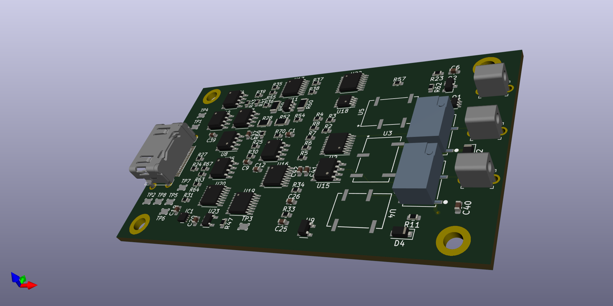
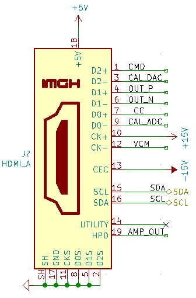
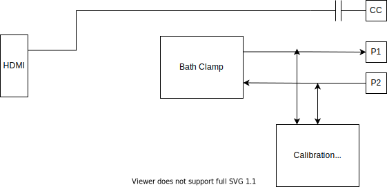

# COVG Clamp Board 

Schematic and layout for the COVG bath and guard clamps. This board sits near electrodes and includes a force output and a high-impedance feedback input to create a closed-loop clamp. Intention is to use the same design for the bath and guard clamps of a COVG amplifiers. The board supports digital programming of the current measurement gain and the feedback loop stability. Switching on the board allows for connect and disconnect of electrodes and injection (or measurements) of calibration signals onto an electrode.

### The PDF plot of the board schematic is [here](docs/bath_clamp_v1.pdf) 
- 2D capture of the 3D model of the clamp board layout: 
<p align="center">


## HDMI: connection from DAQ to daughtercard 

The digital COVG project uses the concept of one main data acquition board connected to an FPGA. The main data acquisition board has multiple channels that extend to daughtercards. The connection to each daughtercard allows for low-latency control by connections to high-speed ADCs and DACs on the daq board. For COVG the daughtercards are the bath clamp; the guard clamp; the voltage clamp and I force; and the V1/V2. The connectivity to the daughtercard is generalized and will be the same for each. 

An HDMI-A cable is used for input and output signals that connects the bath clamp daughtercard to the DAQ board. The HDMI cable carries:

- **power**: +5V, +15V, -15V
- **GND** 
- **Analog outputs** (to ADCs): 
	- OUT\_P, OUT\_N differential pair (x1) to 5 MSPS ADC 
	- single-ended out AMP\_OUT, CAL\_ADC both to individual channel of 1 MSPS ADC (ADS8686) 
- **Analog reference**: VCM: buffered ADC common-mode voltage (nominal 2.5 V)
- **Digital inputs** (from DACs): 
	- CMD: (command signal) from 1 us settling time DAC (attenuated by x10 at board)
	- CC: (capacitive compensation) from 1 us settling time DAC. AC coupled. 
	- CAL_DAC: from 5 us settling time DAC (DAC8050). Either voltage source or current source (Howland current pump), programmable on DAQ board
- **Digital control** (I2C): SDA, SCL (@ 3.3 V levels). Pull-ups are on DAQ board not on the daughtercards! The daughtercards use a TCA9555 I/O expander to generate many control signals from the I2C interface. 
- **Utiility** grab-bag connected to test-point. Jumper on DAQ board to set to analog in, analog out or digital I/O.





| Pin | HDMI name    | Generic Daughtercard     | Bath clamp | Notes  |
|-----|--------------|--------------|------------|---------------------------------------------------------------------------|
| 1   | Data2+       | fastDAC1     | CMD        | ~1 us settling time                      |
| 2   | Data2 shield | Gnd          | Gnd        |                                                                           |
| 3   | Data2-       | Analog/GPIO1 | CAL_DAC    | Analog input signal from DAC8050, 16 bit, 5us settle, 5 V supply                                                                         |
| 4   | Data1+       | fastADC+     | IM_P       | to AD7960/AD7961. Differential low-pass filter on DAQ board                                                                          |
| 5   | Data1 shield | Gnd          | Gnd        |                                                                           |
| 6   | Data1-       | fastADC-     | IM_N       | to AD7960/AD7961. Differential low-pass filter on DAQ board                                                                          |
| 7   | Data0+       | fastDAC2     | CC         | ~1 us settling time                                                                          |
| 8   | Data0 shield | Gnd          | Gnd        |                                                                           |
| 9   | Data0-       | Analog/GPIO2 | CAL_ADC    | to ADS8686 1 MSPS, programmable PGA for range up to +/-10V                                                           |
| 10  | Clock+       | 15V          | 15V        | From a linear regulator on the DAQ board, 75 mA max per channel                                                                         |
| 11  | Clock shield | Gnd          | Gnd        |                                                                           |
| 12  | Clock-       | VCM          | VCM        | buffered on DAQ board, nominal 2.5 V                                                                          |
| 13  | CEC          | -15V         | -15V       | From a linear regulator on the DAQ board, 75 mA max per channel                             |
| 14  | Reserved     | open         | open       | Resistor jumper on DAQ board sets as analog in, analog out, or digital I/O (@ 3.3 V levels). Default stuffing option is to connect to the general purpose ADC (ADS8686). |
| 15  | SCL          | SCL          | SCL        | I2C clock. Pull-up on main DAQ board, 3.3 V levels                |
| 16  | SDA          | SDA          | SDA        | I2C data. Pull-up on main DAQ board, 3.3 V levels                 |
| 17  | Gnd          | Gnd          | Gnd        |                                                                           |
| 18  | 5V           | 5V           | 5V         | Power input from linear regulator, 200 mA max per channel (target)  |
| 19  | HPD          | Analog/GPIO3 | AMP_OUT    | output to ADS8686 1 MSPS, programmable PGA                        |


## Electrode Configurations and Modes 

### Electrodes

The electrode connections are [tip jack miniature PCB mount connectors](https://www.digikey.com/en/products/detail/cinch-connectivity-solutions-johnson/105-1103-001/241122?s=N4IgTCBcDaIIwAYCsBaOiDMKELiAugL5A) for 0.08" diameter pin connections. 

- J1 corresponds to Dagan P2 - force
- J2 corresponds to Dagan P1 - sense
- J3 corresponds to Dagan CC - capacitive compensation 

### Modes 
**Electrode diagnositcs / calibration / system ID** 

Five relays are used to:

1. Disconnect the electrodes from the active electronics (relay K2, K1). Digital control signals: *P1\_E\_CTRL*, *P2\_E\_CTRL*
2. Switch between active and passive clamp (U3). Digital control signals: *P\_CLAMP\_CTRL*
3. Connect calibration signals (ADC or DAC) to the electrodes (U4, U5). Digital control signals: *P1\_CAL\_CTRL*, *P2\_CAL\_CTRL*
A logical high digital control signal closes the Ux relays. A logical high swicthes the Kx relays so that the electronics and electrodes are disconnected. 

**Calibration** 
When "calibrating" the electrode that is driven by a DAC signal or output along the ADC signal CAL\_ADC is programmable. This output multiplexing is set by DAC\_SEL[1..4] and ADC\_SEL[1..4]. Via DAC\_SEL[1..4] an electrode can be connected to CAL\_DAC or GND. The ADC\_SEL[1..4] controls the signal that is connected to CAL\_ADC pin the options are (CAL\_SIG1, CAL\_SIG2, INAMP\_OUT, CC).   

**Clamping**

- _Voltage clamp_: U1 drives the command voltage (CMD) to electrode P2. Nominal voltage clamp mode will have all 5 relays in nominal position (with 0 coil current).  When in voltage clamp mode the current to P2 (as measured by the voltage across nets RF\_1 and P2) is output by the different ADC driver for 5 MSPS digitization. The settings for U22 (TMUX6136) are S1 = 1 for  the inamp output to be buffered out to the 5 MSPS ADC; and S2 = 1 so that the instrumentation amplifier amplifies the voltage difference: (P2 - RF_1). The voltage feedback in voltage clamp mode can be enabled/disabled by the I/O expander siganl *FDBK* (*FDBK*=0 is disabled). 

- _Current clamp_: The board has a Howland current source that can be used to set the current to P2 based upon the CMD signal (requires A2=A1=A0=0). The output current can range from +/-0.26 nA (with a 1.22 mV CMD) to +/-2.1 uA (with a 10 V CMD signal). To enable the current clamp either float or drive high the signal EN\_IPUMP. To shutoff the amplifier set EN\_IPUMP to a logical 0. When in current clamp mode the intent is that the 5 MSPS ADC measurement is of P1 (i.e. set current and measure voltage). This is accomplished by these settings for U22 (TMUX6136): S1 = 0 so that the P2 buffer output voltage is sent to the 5 MSPS ADC; and S2 = 0 so that the instrumentation amplifier amplifies P2 - 0 (RF_1 voltage will not make sense in this mode). In this mode the instrumentation amplifier output can buffer out the CAL\_OUT line to a 1 MSPS ADC channel. 

### Adjustments for clamp stability 
The P2 signal is amplified and buffered before being fedback to the main clamp amplifier (U15 within feedback\_buffer). The stability of this loop varies depending upon the load presented by the cell under test, electrode electrical characteristics, and parasitic capacitive coupling between electrodes. The stability of this feedback loop can be adjusted by modification of the feedback buffer gain and by changing the capacitance of a lead compensator at the summing junction of the main amplifier (inverting terminal). 

**Feedback buffer gain**

The feedback buffer is a non-inverting structure with an adjustable gain set by I/O expander bits RF[1..4]. The feedback resistor values are 3.01k, 12.1k, 30.1k, and 60.4k. The resistor from the inverting terminal to "ground" is 3.01k creating gains of 

- x2 = 1+3.01k/3.01k 
- x5 
- x11
- x21 

**Feedback buffer offset**

The feedback buffer has offset adjustment. This is generated by a 10-bit I2C interface DAC, IC1 (DAC53401), followed by a unipolar to bipolar amplifier (U23). The output of the bipolar converter ranges between +/-1 V (resolution of 1.9 mV / bit). OUT = VDAC*1.666-1. 

(simulation: non\_inverting\_rpot\_bw.asc)

**Compensation adjustment**

Adjustments of the closed-loop stability are achieved using four approaches. 

- The primary approach is a lead compensator formed by R30 in parallel with the capacitors in the compensation switching sheet. This method is presented in "Voltage Clamping of Excitable Membranes" by Bezanilla, Vergara, and Taylor. The compensation capacitors (47 pF, 200 pF, 1 nF, 4.7 nF) are selectable using the the TMUX6111 I/O expander bits CCOMP[1..4].
- A second approach is adjusting the gain of the feedback buffer (see above). 
- A third approach is a stabilizing feedback network of R in series with C; simulations have shown little beneift of this network. Also, beware that the C forms a pole with the current resolving resistor (R\_F) which can be very low frequency. The footprints for these components are included by not populated. This is also presented in Bezanilla, et al.
- The fourth potential approach is an input lead-lag compensator formed by R69 and C37 (unpopulated). See [TI App Note AN-1604](https://www.ti.com/lit/an/snoa486b/snoa486b.pdf?ts=1623954308102&ref_url=https%253A%252F%252Fwww.google.com%252F)


### Adjustments for current measurement

The current measurement gain (historically reported in units of mV/nA) is determined by three separate "stages".

**Resolving inline resistor**: is set by component U2 which is an analog switch (ADG1208) that determines the resistance across which the clamp current is measured. 

| Ref. Des. | Value    | mV/nA            | A2,A1,A0 | Closed Switch   | 
|-----|--------------|--------------|------------|------------|
| none -> Iclamp| n/a | n/a | 0,0,0 | Sw1 |
| R2   | 10 kOhm       |  0.01       | 0,0,1 | Sw2      | 
| R3   | 33.2 kOhm       |  0.033       | 0,1,0 | Sw3      | 
| R4   | 100k Ohm       |  0.1       | 0,1,1 | Sw4      | 
| R5   | 332 kOhm       |  0.332       | 1,0,0 | Sw4      | 
| R6   | 1 MOhm       |  1       | 1,0,1 | Sw5      | 
| R7   | 3.32 MOhm       |  3.32       | 1,1,0 | Sw6      | 
| R8   | 10 MOhm       |  10       | 1,1,1 | Sw7      | 

**Instrumentation Amplifier gain**  

There is a second stage that allows for additional gain on the analog output signal before ADC conversion. The gain of the instrumentation amplifier (AD8421) within the adc\_driver block gain is adjusted with bits G[1..3].
The gain options as controled by U17 (DG412 switch) are: 

- G = 1, G1=G2=G3=0, all switches open 
- G = 1.99, G1 = 1, others = 0 
- G = 4.98, G2 = 1, others = 0
- G = 10.00, G3 = 1, others = 0 
- G = 50, This setting is currently not programmable but set by resistors. 
- Other gains are available by combining the gain settings resistors in parallel. 

For the instrumentation amplifier Gain = 1 + 9.9 kOhm/RG 

**Output ADC driver gain**

The ADC output driver implements a gain of around 1/3 (0.308 = 499 Ohms/(1500 + 120) Ohms) to scale the maximum output of the instrumenation amplifer (+/-13.5 V) to the range of the AD796x ADC (+/-4.096 V).

**Total gain** 

(without the G = 50 option of the instrumentation amplifier) the available gain ranges are:

- min: 0.00308 mV/nA 
- max: 30.8 mV/nA. 

Since the ADC covers a range of +/-4.096 V at 16-bit resolution for step-sizes of:

- min-gain: 0.0246 LSB/nA  (40.6 nA/LSB)
- max-gain: 246.4 LSB/nA  (4.06 pA/LSB)

The amplifier noise simulates to be (very roughly) 1 nA RMS, such that ADC quantization noise will not limit amplifier performance when high-gain settings are used.

## I2C Address Table
| Component | Description | I2C address | I2C mode | 
| --------- | -------- | ------------| ------------|
| U12    | I/O expander 0: TCA9555       | 0x26 = 'b010\_0110 | Standard, Fast |
| U13    | I/O expander 1: TCA9555        | 0x20 = 'b010\_0000 | Standard, Fast |
| U6   | Unique ID EEPROM: 24AA025UID    | 0x50 = 'b101\_0000 | Standard, Fast |
| IC1   | Offset adj. DAC: DAC53401  | 0x48 = 'b100\_1000 | Standard, Fast, Fast+ |


## Current Draw

+/-15 V  (or from the +7V and -2.5 V supplies derived from +/-15 V) 

| Component | Quantity | Current [mA]| Total [mA] |
| --------- | -------- | ------------| ---------- |
| OPA828    | 2        | 5.5 | 11 |
| OPA2156   | 2 (dual) | 4.4 | 8.8 |
| OPA991S   | 1        | 0.56 | 0.56 |
| ADG1208   | 1        | 0.0001 | 0 |
| ADG1208   | 1        | 0.0001 | 0 |
| AD8421    | 1        | 2.3    | 2.3 |
| ADA4932 (ADC driver)  | 1        | 9.6    |     |
| or LMP8350 (ADC driver) |         | 15 (HP mode) | 15 |
|           |          |        | Totals (w/ LMP) |
|           |          |        |    37.66 |


## For Board and FPGA Designers

## KiCAD Setup (libraries)
Before opening the project complete these steps to setup your parts libraries. 

* On the main Kicad Menu bar click 'Preferences' -> 'Configure Paths'. 
* Then within the 'Configure Paths' window create an Environmental Variable with the 'Name' MYLIBRARY.
* Set the 'Path' to be where you will store the Digikey libraries and the COVG custom library. For example (this is on a MAC) '/Users/lucas/Documents/kicad/libraries'.

Now *git clone* (effectively download) the digikey and COVG libraries. 

* The Digikey library is at [https://github.com/Digi-Key/digikey-kicad-library](https://github.com/Digi-Key/digikey-kicad-library)
	* Use the terminal command: `git clone https://github.com/Digi-Key/digikey-kicad-library.git ` 

* The custom COVG library is at [https://github.com/lucask07/covg-kicad-lib](https://github.com/lucask07/covg-kicad-lib)
	* Use the terminal command: `git clone https://github.com/lucask07/covg-kicad-lib.git `
	* This is a private repository so will require you to request access to the repository from Lucas. 

Symbols and footprints custom to this design (and the COVG project in general) are housed in the [covg-kicad-lib repository](https://github.com/lucask07/covg-kicad-lib). This library should be a project specific library in your KiCAD *Symbol Library Management* and *Footrpint Library Management*. 

### LMP8350 ADC Driver 

Initial designs used the ADA4932-1 differential ADC driver to drive the AD7961 on the DAQ board. However, as part of the "chip shortage of 2021" there parts were hard to find in spring of 2021. An alternative part (and possibly better option) used for this board is the [LMP8350](https://rocelec.widen.net/view/pdf/d6pm6sbaz5/lmp8350.pdf?t.download=true&u=5oefqw).

## BOM (bill of materials)

The BOM is available [here](bom/bath_clamp_v1_bom.xlsx)

Two command-line tools are useful for finding and ordering the parts for the board. 

[kifield](https://xess.com/KiField/docs/_build/singlehtml/index.html): extracts all fields from components on the schematic into a spreadsheet and also allows for "injecting" updates in the spreadsheet into the schematic.

Example to extract parts:
```kifield -x covg_daq_v2.sch --recurse -i covg_daq_v2_parts.csv```

**Don't import parts from the CSV into the board! This seems to incorrectly update some components!!**:
``` kifield -x covg_daq_v2_parts.csv --recurse -i covg_daq_v2.sch ```

[kicost](https://github.com/xesscorp/KiCost) which scrapes availability and prices from various distributors and creates a spreadsheet of component cost. 

## Changelog (v1 ---> v2)
1. Add an Alternate Manf# field to all ICs (where possible). The alternative part must be pin compatible. If available add a Alternate2 Manf#. Need alternative to the TMUX6136 (or switch to a 4x SPST + 2 channel inverter). Need alternative to the AD8421 instrumentation amplifier.  
2. Use +/-15 V op-amp to buffer 3.3 V into amplifier. Eliminates problem of the 3.3 V net rising since the regulator cannot sink current.  (done)
3. Switch to a DAC with leads to improve solderability. (done)
4. Correct ADG1208 Manf# to ADG1208YRUZ so that the package matches the footprint (16-TSSOP).  (done)
5. Change resistor values in adjustable regulators for lower negative voltage. 
6. Switch LM337 to ___  TPS7A3401DGNT 


## Funding 
Research reported in this publication was supported by the National Institute Of Neurological Disorders And Stroke of the National Institutes of Health under Award Number R15NS116907. The content is solely the responsibility of the authors and does not necessarily represent the official views of the National Institutes of Health.

<!---
## Block diagram - To Be Completed! 
drawio (also named add.diagrams.net) is used to create block diagrams by integrating drawio with the GitHub repository. 



--->
